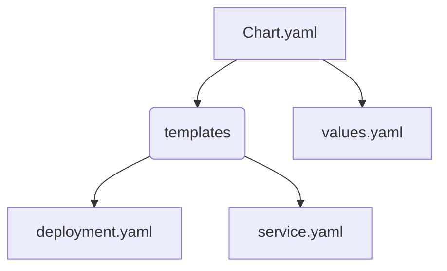
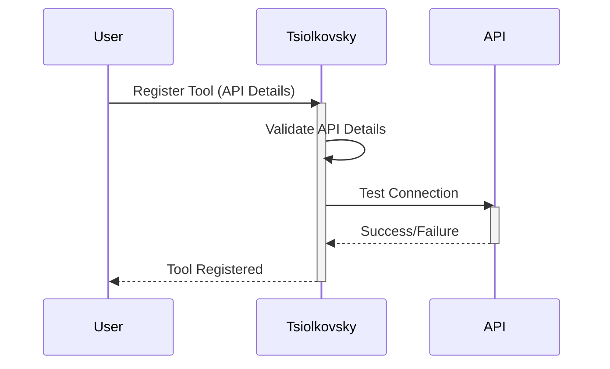
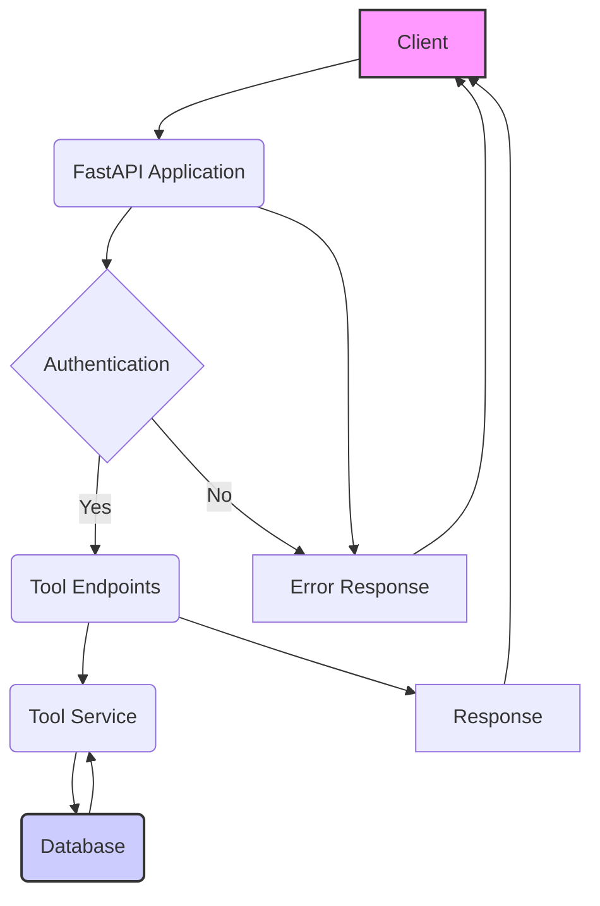
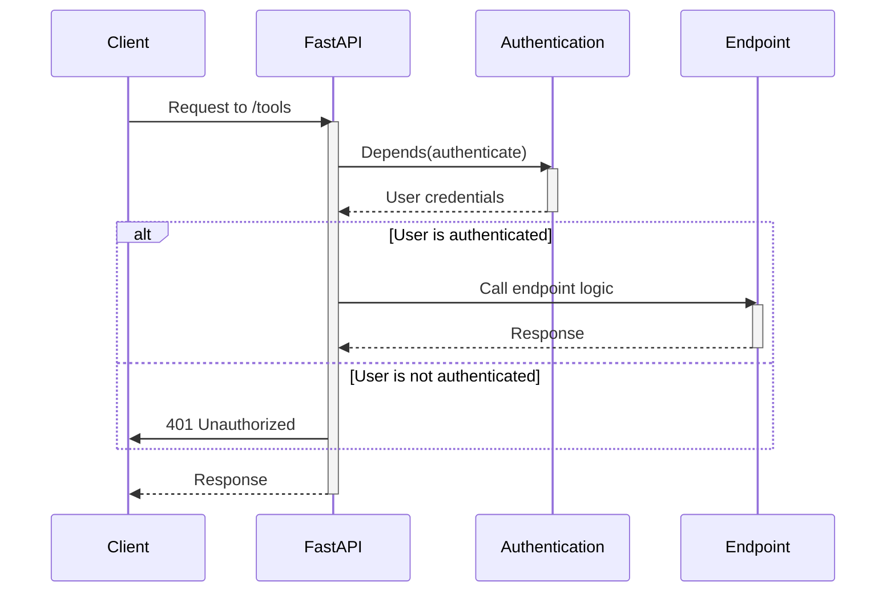
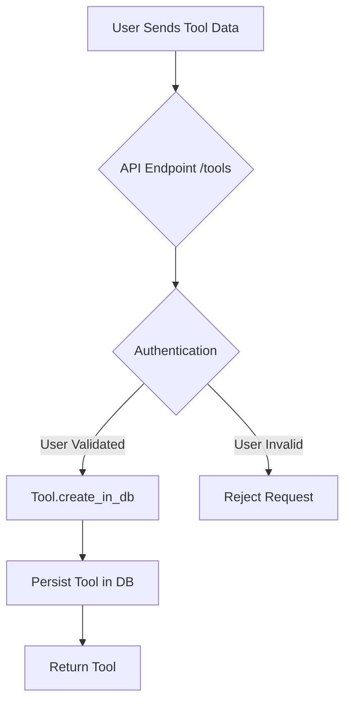
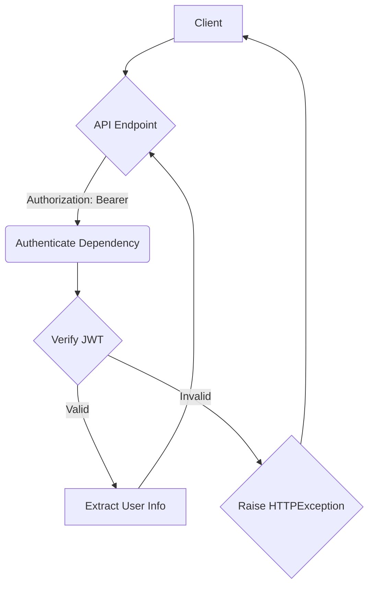

# Wiki Documentation for https://github.com/FyodorovAI/Tsiolkovsky

Generated on: 2025-05-20 13:52:15

## Table of Contents

- [Introduction](#overview-intro)
- [Use Cases](#overview-usecases)
- [Architecture Overview](#arch-overview)
- [Data Flow](#data-flow)
- [Tool Registration](#feature-tool-registration)
- [Access Control](#feature-access-control)
- [Backend API](#backend-api)
- [Authentication](#backend-auth)
- [Deployment Setup](#deploy-setup)
- [Helm Deployment](#deploy-helm)

<a id='overview-intro'></a>

## Introduction

### Related Pages

Related topics: [Use Cases](#overview-usecases), [Architecture Overview](#arch-overview)

<details>
<summary>Relevant source files</summary>

The following files were used as context for generating this wiki page:

- [README.md](README.md)
- [src/main.py](src/main.py)
- [helm/Chart.yaml](helm/Chart.yaml)
- [helm/values.yaml](helm/values.yaml)
- [helm/templates/deployment.yaml](helm/templates/deployment.yaml)
- [helm/templates/service.yaml](helm/templates/service.yaml)
</details>

# Introduction

Tsiolkovsky is a service designed for managing agent tools, enabling Large Language Models (LLMs) to interact with and learn from the external world through registered tools. It facilitates the registration, access control, and authentication of these tools, which can range from public and private APIs to locally hosted services. The service aims to provide a centralized platform for managing the tools that LLM agents use to perform various tasks. Sources: [README.md]()

Tsiolkovsky is implemented as a FastAPI application, allowing for the creation of tools via YAML definitions or standard API endpoints. It supports authentication and authorization to control access to these tools, and it is designed to be deployed in a containerized environment using Helm. The service provides endpoints for creating, retrieving, updating, and deleting tools, as well as managing agent associations with these tools. Sources: [src/main.py](), [helm/Chart.yaml](), [helm/values.yaml]()

## Key Features

Tsiolkovsky offers several key features to facilitate the management of agent tools:

*   **Tool Registration:** Allows users to register new tools with the service, specifying details such as API endpoints, authentication methods, and descriptions. Sources: [src/main.py]()
*   **Access Control:** Provides mechanisms to control access to tools on a per-user or per-LLM basis. Sources: [src/main.py]()
*   **Authentication:** Supports authentication to remote APIs, enabling agents to securely access protected resources. Sources: [src/main.py]()
*   **Dynamic IP Support:** Enables the registration of services running on the edge with dynamic IPs. Sources: [README.md]()
*   **YAML Configuration:** Supports tool creation from YAML definitions, simplifying the configuration process. Sources: [src/main.py]()

## Architecture

Tsiolkovsky's architecture comprises several key components that work together to provide tool management capabilities.

### Components

*   **FastAPI Application:** The core of Tsiolkovsky is a FastAPI application that handles API requests and responses. Sources: [src/main.py]()
*   **Tool Model:** Represents the structure of a tool, including its name, description, API endpoint, and other relevant details. Sources: [src/main.py]()
*   **Database:** Stores tool definitions, user information, and access control policies. (Implicit, not directly visible in the provided files but necessary for persistence).
*   **Authentication Middleware:** Enforces authentication and authorization policies to protect API endpoints. Sources: [src/main.py]()

### Data Flow

The following diagram illustrates the data flow within Tsiolkovsky:

```mermaid
graph TD
    A[Client (LLM Agent)] --> B(FastAPI Application);
    B -- Registers/Requests Tool --> C(Database);
    C -- Returns Tool Definition --> B;
    B -- Authenticates with Tool API --> D[External API];
    D -- Returns Data --> B;
    B -- Returns Data to Client --> A;
    style A fill:#f9f,stroke:#333,stroke-width:2px
    style D fill:#ccf,stroke:#333,stroke-width:2px
```

This diagram shows how a client (LLM Agent) interacts with the FastAPI application to register or request a tool. The application retrieves the tool definition from the database, authenticates with the external API, and returns the data to the client. Sources: [src/main.py]()

### API Endpoints

Tsiolkovsky provides a set of API endpoints for managing tools:

| Endpoint                   | Method | Description                                                        |
| -------------------------- | ------ | ------------------------------------------------------------------ |
| `/`                        | GET    | Returns a welcome message.                                         |
| `/health`                  | GET    | Performs a health check.                                          |
| `/.well-known/{user_id}/{name}.yaml` | GET    | Retrieves a tool definition in YAML format.                             |
| `/tools/yaml`              | POST   | Creates a tool from a YAML definition.                             |
| `/tools`                   | POST   | Creates a new tool.                                                |
| `/tools`                   | GET    | Retrieves a list of tools.                                         |
| `/tools/{id}`              | GET    | Retrieves a specific tool by ID.                                   |
| `/tools/{id}/agents`       | GET    | Retrieves agents associated with a tool.                           |
| `/tools/{id}/agents`       | POST   | Sets the agents associated with a tool.                            |
| `/tools/{id}`              | PUT    | Updates an existing tool.                                          |
| `/tools/{id}`              | DELETE | Deletes a tool.                                                    |
| `/oauth/callback/{service_name}` | POST | Handles OAuth callbacks from external services.                    |

Sources: [src/main.py]()

### Authentication

Tsiolkovsky uses JWT (JSON Web Tokens) for authentication. The `authenticate` dependency in the API endpoints verifies the JWT token in the request header and extracts user information. This ensures that only authorized users can access and modify tools. Sources: [src/main.py]()

The following code snippet shows how the `authenticate` dependency is used in the `/tools` endpoint:

```python
# src/main.py:53-56
@app.post("/tools")
@error_handler
async def create_tool(tool: ToolModel, user=Depends(authenticate)):
    print(f"User: {user}")
    # Pass the authenticated user's ID when creating the tool in the database
    tool = await Tool.create_in_db(user["session_id"], tool, user["sub"])
    return tool
```

This snippet demonstrates how the `authenticate` dependency is used to verify the user's identity before creating a new tool. Sources: [src/main.py:53-56]()

## Deployment

Tsiolkovsky is designed to be deployed in a containerized environment using Kubernetes and Helm.

### Helm Chart

The Helm chart for Tsiolkovsky simplifies the deployment process by providing a set of Kubernetes manifests that define the resources required to run the service. The chart includes templates for:

*   **Deployment:** Defines the deployment configuration, including the number of replicas, image to use, and environment variables. Sources: [helm/templates/deployment.yaml]()
*   **Service:** Defines the service configuration, including the port to expose and the service type. Sources: [helm/templates/service.yaml]()
*   **Values:** Provides a set of default values for configuring the deployment. Sources: [helm/values.yaml]()

The following diagram illustrates the structure of the Helm chart:



This diagram shows the relationship between the `Chart.yaml` file, the `templates` directory, and the `values.yaml` file. The `Chart.yaml` file defines the chart metadata, the `templates` directory contains the Kubernetes manifests, and the `values.yaml` file provides the default configuration values. Sources: [helm/Chart.yaml](), [helm/templates/deployment.yaml](), [helm/templates/service.yaml](), [helm/values.yaml]()

### Configuration

The `values.yaml` file allows you to configure various aspects of the deployment, such as:

*   **Replica Count:** The number of replicas to run. Sources: [helm/values.yaml]()
*   **Image:** The Docker image to use. Sources: [helm/values.yaml]()
*   **Service Type:** The type of service to create (e.g., ClusterIP, NodePort, LoadBalancer). Sources: [helm/values.yaml]()
*   **Environment Variables:** The environment variables to set for the container. Sources: [helm/values.yaml]()

The following table shows some of the key configuration options:

| Option                     | Description                               | Default Value |
| -------------------------- | ----------------------------------------- | ------------- |
| `replicaCount`             | The number of replicas to run.          | `1`           |
| `image.repository`         | The Docker image repository.              | `ghcr.io/fyodorovai/tsiolkovsky` |
| `image.tag`                | The Docker image tag.                     | `main`        |
| `service.type`             | The type of service to create.            | `ClusterIP`   |
| `env.supabaseProjectURL`   | Supabase project URL                      | `""`          |
| `env.supabaseAPIKey`       | Supabase API Key                          | `""`          |
| `env.jwtSecret`            | JWT Secret                                | `""`          |

Sources: [helm/values.yaml]()

### Deployment Steps

To deploy Tsiolkovsky using Helm, follow these steps:

1.  Install Helm.
2.  Clone the Tsiolkovsky repository.
3.  Navigate to the `helm` directory.
4.  Customize the `values.yaml` file as needed.
5.  Run `helm install tsiolkovsky .` to deploy the chart.

## Conclusion

Tsiolkovsky provides a comprehensive solution for managing agent tools, enabling LLMs to interact with the external world in a controlled and secure manner. Its features, architecture, and deployment options make it a valuable tool for developers building LLM-powered applications.


---

<a id='overview-usecases'></a>

## Use Cases

### Related Pages

Related topics: [Introduction](#overview-intro)

<details>
<summary>Relevant source files</summary>

The following files were used as context for generating this wiki page:

- [README.md](README.md)
- [src/main.py](src/main.py)
- [helm/values.yaml](helm/values.yaml)
- [helm/templates/deployment.yaml](helm/templates/deployment.yaml)
- [helm/templates/service.yaml](helm/templates/service.yaml)
- [helm/Chart.yaml](helm/Chart.yaml)
</details>

# Use Cases

Tsiolkovsky is a service designed for managing agent tools, enabling Large Language Models (LLMs) to interact with and learn from the world around them. It allows users to register tools, control access, authenticate to remote APIs, and register services running on the edge with dynamic IPs. This system is particularly useful for adding various APIs as tools for agents, enhancing their capabilities.  The service is built using FastAPI and supports features like user authentication, tool management, and API integration. Sources: [README.md]()

## Tool Management

Tsiolkovsky provides functionalities to manage tools that agents can use. These tools can range from public APIs to locally hosted services. The core features include registering tools, controlling access based on users or LLMs, and handling authentication for remote APIs. Sources: [README.md](), [src/main.py]()

### Registering Tools

Tsiolkovsky allows users to register tools through a REST API. The API supports creating tools from YAML configurations or directly through a `ToolModel` object.  The tool registration process involves authenticating the user and storing the tool details in a database. Sources: [src/main.py:47-60]()

```python
@app.post("/tools/yaml")
@error_handler
async def create_tool_from_yaml(request: Request, user=Depends(authenticate)):
    try:
        tool_yaml = await request.body()
        tool = ToolModel.from_yaml(tool_yaml)
        await Tool.create_in_db(user["session_id"], tool, user["sub"])
        return tool
    except Exception as e:
        print("Error creating tool from yaml", str(e))
        raise HTTPException(status_code=400, detail="Invalid YAML format")
```
This code snippet shows how a tool can be created from a YAML configuration via a POST request to the `/tools/yaml` endpoint. It authenticates the user, converts the YAML to a `ToolModel`, and stores it in the database.  Sources: [src/main.py:47-60]()

### Access Control

Access control is managed per user or LLM, ensuring that only authorized entities can use specific tools. The authentication mechanism uses JWT tokens to verify user identity. Sources: [src/main.py:31-33]()

```python
@app.get("/tools/{id}")
@error_handler
async def get_tool(id: str, user=Depends(authenticate)):
    return await Tool.get_in_db(user["session_id"], id)
```

This snippet demonstrates how the `authenticate` dependency is used to ensure that only authenticated users can access tool details. The user's session ID is used to retrieve the tool from the database. Sources: [src/main.py:73-75]()

### Authentication

Tsiolkovsky handles authentication to remote APIs, allowing tools to securely access external services.  The system supports various authentication methods, including OAuth. Sources: [src/main.py:97-117]()

```python
@app.post("/oauth/callback/{service_name}")
async def oauth_callback(service_name: str, request: Request):
    # Extract the necessary data from the callback request
    # This part varies greatly between services and needs to be adapted accordingly
    callback_data = await request.json()

    # Validate and process the callback data
    # This is a simplified example; actual implementation will vary
    access_token = callback_data.get("access_token")
    # refresh_token = callback_data.get("refresh_token")
    # expires_in = callback_data.get("expires_in")
    # user_id = callback_data.get("user_id")  # This will depend on the service

    if not access_token:
        raise HTTPException(status_code=400, detail="Access Token missing")

    # Save the credentials to supabase

    # Return a success response
    return JSONResponse(status_code=200)
```

This code shows the OAuth callback endpoint, which extracts the access token from the callback request and validates it. The access token can then be used to authenticate requests to the remote API.  Sources: [src/main.py:97-117]()

## API Integration

Tsiolkovsky facilitates the integration of various APIs, including public, private, and locally hosted APIs. It supports APIs that require authentication and those running on the edge with dynamic IPs. Sources: [README.md]()

### Supported API Types

The system supports a wide range of APIs, making it versatile for different use cases:

*   **Public APIs:** Freely available APIs that can be integrated without specific authentication.
*   **Private APIs:** APIs that require authentication and authorization to access.
*   **Locally Hosted APIs:** APIs running on local servers, even with dynamic IPs.

### Example API Integration

Below is a Mermaid diagram illustrating the process of integrating an API as a tool within Tsiolkovsky:



This diagram illustrates the steps involved in registering a tool, including validation and testing the connection to the API.  Sources: [README.md](), [src/main.py]()

## Deployment

Tsiolkovsky can be deployed using Helm, a Kubernetes package manager. The Helm chart simplifies the deployment process, allowing users to configure various aspects of the deployment, such as the number of replicas, image repository, and environment variables. Sources: [helm/Chart.yaml](), [helm/values.yaml](), [helm/templates/deployment.yaml](), [helm/templates/service.yaml]()

### Helm Configuration

The `values.yaml` file contains the default configuration values for the Helm chart. These values can be overridden to customize the deployment. Key configuration options include:

| Parameter                  | Description                                     | Default Value                 |
| -------------------------- | ----------------------------------------------- | ----------------------------- |
| `replicaCount`             | Number of replicas for the deployment           | `1`                           |
| `image.repository`         | Docker image repository                         | `ghcr.io/fyodorovai/tsiolkovsky` |
| `image.tag`                | Docker image tag                                | `main`                        |
| `service.type`             | Kubernetes service type                         | `ClusterIP`                   |
| `env`                      | List of environment variables                   |                               |
| `env.supabaseProjectURL`   | Supabase project URL                            | `""`                          |
| `env.supabaseAPIKey`       | Supabase API key                                | `""`                          |
| `env.jwtSecret`            | JWT secret for authentication                   | `""`                          |

Sources: [helm/values.yaml]()

### Kubernetes Deployment

The `deployment.yaml` file defines the Kubernetes deployment for Tsiolkovsky. It specifies the number of replicas, container image, environment variables, and ports.  Sources: [helm/templates/deployment.yaml]()

```yaml
apiVersion: apps/v1
kind: Deployment
metadata:
  name: {{ .Release.Name }}  # Add this line
spec:
  selector:  # Add this block
    matchLabels:
      app.kubernetes.io/name: {{ .Release.Name }}
      app.kubernetes.io/instance: {{ .Release.Name }}
  {{- if not .Values.autoscaling.enabled }}
  replicas: {{ .Values.replicaCount }}
  {{- end}}
  template:
    metadata:
      labels:  # Add this block
        app.kubernetes.io/name: {{ .Release.Name }}
        app.kubernetes.io/instance: {{ .Release.Name }}
    spec:
      containers:
        - name: {{ .Chart.Name }}
          image: "{{ .Values.image.repository }}:{{ .Values.image.tag | default .Chart.AppVersion }}"
          imagePullPolicy: {{ .Values.image.pullPolicy }}
          env:
            {{- range .Values.env }}
            - name: {{ .name }}
              value: {{ .value | quote }}
            {{- end }}
          ports:
            - name: http
              containerPort: 8000
              protocol: TCP
          livenessProbe:
            httpGet:
              path: /health
              port: http
          readinessProbe:
            httpGet:
              path: /health
              port: http
```

This YAML configuration defines the deployment, including labels, replica count (based on autoscaling settings), container details (image, pull policy, environment variables),
Error: 503 The model is overloaded. Please try again later.

---

<a id='arch-overview'></a>

## Architecture Overview

### Related Pages

Related topics: [Data Flow](#data-flow), [Backend API](#backend-api)

<details>
<summary>Relevant source files</summary>

The following files were used as context for generating this wiki page:

- [src/main.py](src/main.py)
- [fyodorov_llm_agents/tools/mcp_tool_model.py](fyodorov_llm_agents/tools/mcp_tool_model.py)
- [fyodorov_llm_agents/tools/mcp_tool_service.py](fyodorov_llm_agents/tools/mcp_tool_service.py)
- [src/utils.py](src/utils.py)
- [helm/Chart.yaml](helm/Chart.yaml)
- [helm/values.yaml](helm/values.yaml)
</details>

# Architecture Overview

Tsiolkovsky is a service designed for managing agent tools, enabling Large Language Models (LLMs) to interact with and learn from the external world through registered tools. This architecture overview describes the key components, API endpoints, and overall structure of the Tsiolkovsky service. The service provides functionalities for registering tools, controlling access, authenticating with remote APIs, and managing services running on the edge with dynamic IPs. [README.md]()

## Core Components

The Tsiolkovsky architecture consists of several key components that work together to provide tool management capabilities. These components include:

*   **API Endpoints:** FastAPI-based endpoints for managing tools, including creation, retrieval, updating, and deletion.
*   **Tool Model:** A Pydantic model (`ToolModel`) representing the structure and attributes of a tool.
*   **Tool Service:** A service (`Tool`) that handles database interactions for managing tool data.
*   **Authentication:** Authentication mechanisms to secure the API endpoints and control access to tools.
*   **Error Handling:** A decorator (`error_handler`) for handling exceptions and providing consistent error responses.



This diagram illustrates the high-level flow of requests from a client to the Tsiolkovsky service, including authentication, interaction with tool endpoints, and database access. Sources: [src/main.py](), [src/utils.py]()

## API Endpoints

The Tsiolkovsky API exposes several endpoints for managing tools. These endpoints are built using FastAPI and provide functionalities for creating, retrieving, updating, and deleting tools. [src/main.py]()

### Tool Management Endpoints

| Endpoint          | HTTP Method | Description                                                                 |
| ----------------- | ----------- | --------------------------------------------------------------------------- |
| `/tools`          | POST        | Creates a new tool.                                                         |
| `/tools`          | GET         | Retrieves a list of tools.                                                  |
| `/tools/{id}`     | GET         | Retrieves a specific tool by its ID.                                        |
| `/tools/{id}`     | PUT         | Updates a specific tool by its ID.                                        |
| `/tools/{id}`     | DELETE      | Deletes a specific tool by its ID.                                         |
| `/tools/{id}/agents`| GET         | Retrieves agents associated with a specific tool.                           |
| `/tools/{id}/agents`| POST        | Sets agents associated with a specific tool.                           |
| `/tools/yaml`     | POST        | Creates a tool from a YAML configuration.                                  |
| `/.well-known/{user_id}/{name}.yaml` | GET | Retrieves a tool configuration in YAML format for a specific user and tool name. |

Sources: [src/main.py:40-130]()

### Example: Creating a Tool

The `/tools` endpoint allows creating a new tool by providing a `ToolModel` instance in the request body. The endpoint authenticates the user and stores the tool in the database.

```python
@app.post("/tools")
@error_handler
async def create_tool(tool: ToolModel, user=Depends(authenticate)):
    print(f"User: {user}")
    # Pass the authenticated user's ID when creating the tool in the database
    tool = await Tool.create_in_db(user["session_id"], tool, user["sub"])
    return tool
```

Sources: [src/main.py:50-56]()

### YAML Configuration

Tools can also be created from a YAML configuration using the `/tools/yaml` endpoint. This endpoint parses the YAML data and creates a `ToolModel` instance.

```python
@app.post("/tools/yaml")
@error_handler
async def create_tool_from_yaml(request: Request, user=Depends(authenticate)):
    try:
        tool_yaml = await request.body()
        tool = ToolModel.from_yaml(tool_yaml)
        await Tool.create_in_db(user["session_id"], tool, user["sub"])
        return tool
    except Exception as e:
        print("Error creating tool from yaml", str(e))
        raise HTTPException(status_code=400, detail="Invalid YAML format")
```

Sources: [src/main.py:35-43]()

## Tool Model

The `ToolModel` class, defined in `fyodorov_llm_agents/tools/mcp_tool_model.py`, represents the structure of a tool. It includes fields for the tool's name, description, API details, and contact information. [fyodorov_llm_agents/tools/mcp_tool_model.py]()

### Tool Model Attributes

| Attribute              | Type    | Description                                                                       |
| ---------------------- | ------- | --------------------------------------------------------------------------------- |
| `name_for_human`       | `str`   | Human-readable name of the tool.                                                  |
| `name_for_ai`          | `str`   | AI-friendly name of the tool.                                                     |
| `description_for_human`| `str`   | Human-readable description of the tool.                                           |
| `description_for_ai`   | `str`   | AI-friendly description of the tool.                                              |
| `api_type`             | `str`   | Type of API (e.g., "openapi").                                                     |
| `api_url`              | `str`   | URL of the API definition.                                                        |
| `logo_url`             | `str`   | URL of the tool's logo.                                                           |
| `contact_email`        | `str`   | Contact email for the tool.                                                       |
| `legal_info_url`       | `str`   | URL of the legal information for the tool.                                        |

### Example: Tool Model Definition

```python
class MCPTool(BaseModel):
    name_for_human: str
    name_for_ai: str
    description_for_human: str
    description_for_ai: str
    api_type: str
    api_url: str
    logo_url: str
    contact_email: str
    legal_info_url: str
```

Sources: [fyodorov_llm_agents/tools/mcp_tool_model.py]()

## Tool Service

The `Tool` service, defined in `fyodorov_llm_agents/tools/mcp_tool_service.py`, handles database interactions for managing tool data. It provides methods for creating, retrieving, updating, and deleting tools in the database. [fyodorov_llm_agents/tools/mcp_tool_service.py]()

### Tool Service Methods

*   `create_in_db()`: Creates a new tool in the database.
*   `get_in_db()`: Retrieves a tool from the database by its ID.
*   `update_in_db()`: Updates a tool in the database.
*   `delete_in_db()`: Deletes a tool from the database.
*   `get_by_user_and_name_in_db()`: Retrieves a tool by user ID and name.
*   `get_all_in_db()`: Retrieves all tools for a given user.
*   `set_tool_agents()`: Sets the agents associated with a tool.
*   `get_tool_agents()`: Retrieves the agents associated with a tool.

## Authentication

The Tsiolkovsky API uses authentication to secure the endpoints and control access to tools. The `authenticate` dependency is used to verify the user's identity based on the provided credentials. [src/main.py]()

### Authentication Flow



This sequence diagram illustrates the authentication flow for API requests. Sources: [src/main.py]()

## Error Handling

The `error_handler` decorator, defined in `src/utils.py`, is used to handle exceptions and provide consistent error responses. It catches exceptions and returns an HTTP error response with a detailed message. [src/utils.py]()

### Example: Error Handler

```python
def error_handler(f):
    @wraps(f)
    async def wrapper(*args, **kwargs):
        try:
            # Use 'await' for async functions
            if asyncio.iscoroutinefunction(f):
                return await f(*args, **kwargs)
            else:
                return f(*args, **kwargs)
        except HTTPException as http_exc:
            print(f"{f.__name__} - HTTP Exception: {http_exc.detail}")
            raise
        except Exception as exc:
            print(f"{f.__name__} - Unhandled Exception: {exc}")
            raise HTTPException(status_code=400, detail="An error occurred")

    return wrapper
```

Sources: [src/utils.py:4-22]()

## Helm Chart

The Tsiolkovsky service can be deployed using a Helm chart. The Helm chart defines the Kubernetes resources required to deploy the service, including deployments, services, and ingress. [helm/Chart.yaml](), [helm/values.yaml]()

### Helm Chart Configuration

The `values.yaml` file contains the configuration options for the Helm chart. These options include the image repository, tag, pull policy, service type, and environment variables.

```yaml
replicaCount: 1

image:
  repository: ghcr.io/fyodorovai/tsiolkovsky
  tag: main
  pullPolicy: Always

service:
  type: ClusterIP
  ports: 
    - port: 8000
      targetPort: 8000
      protocol: TCP
      name: http

env:
  - name: supabaseProjectURL
    value: ""
  - name: supabaseAPIKey
    value: ""
  - name: jwtSecret
    value: ""
```

Sources: [helm/values.yaml]()

## Conclusion

The Tsiolkovsky architecture provides a flexible and scalable solution for managing agent tools. The API endpoints, tool model, and tool service work together to provide a comprehensive tool management platform. The use of FastAPI, Pydantic, and other modern technologies ensures that the service is efficient, reliable, and easy to maintain. The Helm chart simplifies the deployment process and allows the service to be easily deployed in a Kubernetes environment.


---

<a id='data-flow'></a>

## Data Flow

### Related Pages

Related topics: [Architecture Overview](#arch-overview)

<details>
<summary>Relevant source files</summary>

The following files were used as context for generating this wiki page:

- [src/main.py](src/main.py)
- [fyodorov_llm_agents/tools/mcp_tool_model.py](fyodorov_llm_agents/tools/mcp_tool_model.py)
- [fyodorov_llm_agents/tools/mcp_tool_service.py](fyodorov_llm_agents/tools/mcp_tool_service.py)
- [src/utils.py](src/utils.py)
- [models/tool.py](models/tool.py)
- [helm/values.yaml](helm/values.yaml)
</details>

# Data Flow

This page describes the data flow within the Tsiolkovsky service, focusing on how tool data is created, retrieved, updated, and deleted. It covers the API endpoints, data models, and database interactions involved in managing tools for LLM agents. Understanding this data flow is crucial for developers extending or maintaining the Tsiolkovsky service.

## Tool Creation

The creation of a tool involves several steps, starting with receiving the tool data through an API endpoint and ending with storing the tool in the database.

### API Endpoint

The `/tools` endpoint handles the creation of new tools. It accepts a `ToolModel` object in the request body and uses the `create_tool` function to process the request. The endpoint authenticates the user using `Depends(authenticate)` and passes the authenticated user's information for authorization and auditing purposes. `Sources: [src/main.py:50-53]()`

```python
@app.post("/tools")
@error_handler
async def create_tool(tool: ToolModel, user=Depends(authenticate)):
    print(f"User: {user}")
    # Pass the authenticated user's ID when creating the tool in the database
    tool = await Tool.create_in_db(user["session_id"], tool, user["sub"])
    return tool
```
Sources: [src/main.py:50-56]()

### Tool Model

The `ToolModel` class, defined in `fyodorov_llm_agents/tools/mcp_tool_model.py`, represents the data structure for a tool. It includes fields such as `name_for_human`, `name_for_ai`, `description_for_human`, `description_for_ai`, `api_type`, `api_url`, `logo_url`, `contact_email`, and `legal_info_url`. This model is used to validate and serialize tool data. `Sources: [fyodorov_llm_agents/tools/mcp_tool_model.py]()`

### Database Interaction

The `Tool.create_in_db` function is responsible for storing the tool data in the database. It receives the user's session ID, the `ToolModel` object, and the user's ID. The function then persists the tool data, associating it with the user who created it. `Sources: [src/main.py:54](), [fyodorov_llm_agents/tools/mcp_tool_service.py]()`

## Tool Retrieval

Tool retrieval involves fetching tool data from the database based on various criteria, such as tool ID or user ID.

### Get Tool by ID

The `/tools/{id}` endpoint retrieves a specific tool by its ID. It uses the `get_tool` function, which calls `Tool.get_in_db` to fetch the tool data from the database. The endpoint authenticates the user to ensure they have permission to access the tool. `Sources: [src/main.py:64-66]()`

```python
@app.get("/tools/{id}")
@error_handler
async def get_tool(id: str, user=Depends(authenticate)):
    return await Tool.get_in_db(user["session_id"], id)
```
Sources: [src/main.py:64-66]()

### Get All Tools

The `/tools` endpoint retrieves all tools associated with a user. It uses the `get_tools` function, which calls `Tool.get_all_in_db` to fetch the tool data from the database. The endpoint supports pagination using the `limit` and `created_at_lt` parameters. `Sources: [src/main.py:58-62]()`

```python
@app.get("/tools")
@error_handler
async def get_tools(
    limit: int = 10,
    created_at_lt: datetime = datetime.now(),
    user=Depends(authenticate),
):
    return await Tool.get_all_in_db(
        user["sub"], limit=limit, created_at_lt=created_at_lt
    )
```
Sources: [src/main.py:58-63]()

### Get Plugin Well Known

The `/.well-known/{user_id}/{name}.yaml` endpoint retrieves a tool's configuration in YAML format. It uses the `get_plugin_well_known` function, which calls `Tool.get_by_user_and_name_in_db` to fetch the tool data and then converts it to YAML format using the `yaml.dump` function. The endpoint supports authentication using a Bearer token. `Sources: [src/main.py:33-48]()`

```python
@app.get("/.well-known/{user_id}/{name}.yaml")
@error_handler
async def get_plugin_well_known(
    user_id: str, name: str, authorization: str = Header(None)
):
    user = None
    if authorization and authorization.startswith("Bearer "):
        try:
            token = authorization.split(" ")[1]
            creds = HTTPAuthorizationCredentials(scheme="Bearer", credentials=token)
            user = await authenticate(creds)
            print(f"User: {user}")
        except Exception as e:
            print("User not found", e)
    if user:
        tool_dict = await Tool.get_by_user_and_name_in_db(
            user["session_id"], user_id, name
        ).to_plugin()
    else:
        tool_dict = await Tool.get_by_user_and_name_in_db(
            None, user_id, name
        ).to_plugin()
    yaml_str = yaml.dump(tool_dict)
    return Response(content=yaml_str, media_type="application/x-yaml")
```
Sources: [src/main.py:33-48]()

## Tool Update

Tool updates involve modifying existing tool data in the database.

### API Endpoint

The `/tools/{id}` endpoint handles the update of existing tools. It accepts a `ToolModel` object in the request body and uses the `update_tool` function to process the request. The endpoint authenticates the user using `Depends(authenticate)` to ensure they have permission to modify the tool. `Sources: [src/main.py:78-80]()`

```python
@app.put("/tools/{id}")
@error_handler
async def update_tool(id: str, tool: ToolModel, user=Depends(authenticate)):
    return await Tool.update_in_db(user["session_id"], id, tool)
```
Sources: [src/main.py:78-80]()

### Database Interaction

The `Tool.update_in_db` function is responsible for updating the tool data in the database. It receives the user's session ID, the tool ID, and the updated `ToolModel` object. The function then updates the tool data in the database. `Sources: [src/main.py:79](), [fyodorov_llm_agents/tools/mcp_tool_service.py]()`

## Tool Deletion

Tool deletion involves removing tool data from the database.

### API Endpoint

The `/tools/{id}` endpoint handles the deletion of existing tools. It uses the `delete_tool` function, which calls `Tool.delete_in_db` to remove the tool data from the database. The endpoint authenticates the user using `Depends(authenticate)` to ensure they have permission to delete the tool. `Sources: [src/main.py:82-85]()`

```python
@app.delete("/tools/{id}")
@error_handler
async def delete_tool(id: str, user=Depends(authenticate)):
    print(f"Got request to delete tool {id}")
    return await Tool.delete_in_db(user["session_id"], id)
```
Sources: [src/main.py:82-85]()

### Database Interaction

The `Tool.delete_in_db` function is responsible for removing the tool data from the database. It receives the user's session ID and the tool ID. The function then deletes the tool data from the database. `Sources: [src/main.py:84](), [fyodorov_llm_agents/tools/mcp_tool_service.py]()`

## Error Handling

The `@error_handler` decorator is used to wrap API endpoints and handle exceptions. It catches `HTTPException` exceptions and other exceptions, logs the error, and returns an appropriate HTTP response. `Sources: [src/main.py:26](), [src/utils.py]()`

```python
def error_handler(f):
    @wraps(f)
    async def wrapper(*args, **kwargs):
        try:
            # Use 'await' for async functions
            if asyncio.iscoroutinefunction(f):
                return await f(*args, **kwargs)
            else:
                return f(*args, **kwargs)
        except HTTPException as http_exc:
            print(f"{f.__name__} - HTTP Exception: {http_exc.detail}")
            raise
        except Exception as exc:
            print(f"{f.__name__} - Unhandled Exception: {exc}")
            raise HTTPException(status_code=400, detail="An error occurred")

    return wrapper
```
Sources: [src/utils.py:4-20]()

## Summary

The data flow within the Tsiolkovsky service involves creating, retrieving, updating, and deleting tool data. The service uses API endpoints, data models, and database interactions to manage tool data. The `@error_handler` decorator provides a consistent way to handle exceptions and return appropriate HTTP responses. Understanding this data flow is essential for developers working on the Tsiolkovsky service.


---

<a id='feature-tool-registration'></a>

## Tool Registration

### Related Pages

Related topics: [Access Control](#feature-access-control)

<details>
<summary>Relevant source files</summary>

The following files were used as context for generating this wiki page:

- [src/main.py](src/main.py)
- [fyodorov_llm_agents/tools/mcp_tool_model.py](fyodorov_llm_agents/tools/mcp_tool_model.py)
- [fyodorov_llm_agents/tools/mcp_tool_service.py](fyodorov_llm_agents/tools/mcp_tool_service.py)
- [src/tests/test_tool_model.py](src/tests/test_tool_model.py)
- [src/tests/test_tool_integration.py](src/tests/test_tool_integration.py)
- [src/utils.py](src/utils.py)
</details>

# Tool Registration

Tool registration in Tsiolkovsky allows users to add and manage tools that can be used by LLM agents. This involves defining the tool's metadata, API details, and access controls. The registration process covers creating new tools, updating existing ones, and managing access permissions. The system supports tool creation via API endpoints using YAML configurations or direct data input. [Introduction](#introduction)

## Tool Creation

Tool creation is handled through the `/tools` endpoint, supporting both YAML and direct data input. Users can create tools by providing the necessary details such as name, description, API type, and URL. The system authenticates the user and associates the tool with their account.

### Creating Tools via API Endpoint

The `/tools` endpoint accepts `POST` requests with a `ToolModel` payload. The `create_tool` function handles this request, authenticates the user, and then calls the `Tool.create_in_db` function to persist the tool in the database. `Tool.create_in_db` requires the user's session ID, the tool model, and the user's subject (sub). Sources: [src/main.py:53-57](), [src/main.py:55](), [src/main.py:56]()

```python
@app.post("/tools")
@error_handler
async def create_tool(tool: ToolModel, user=Depends(authenticate)):
    print(f"User: {user}")
    # Pass the authenticated user's ID when creating the tool in the database
    tool = await Tool.create_in_db(user["session_id"], tool, user["sub"])
    return tool
```
Sources: [src/main.py:53-57]()

### Creating Tools from YAML

Tools can also be created by sending a YAML configuration to the `/tools/yaml` endpoint. This endpoint receives a YAML string, converts it to a `ToolModel` object, and then persists it in the database using the `Tool.create_in_db` function. If the YAML format is invalid, an HTTP exception with a 400 status code is raised. Sources: [src/main.py:40-47]()

```python
@app.post("/tools/yaml")
@error_handler
async def create_tool_from_yaml(request: Request, user=Depends(authenticate)):
    try:
        tool_yaml = await request.body()
        tool = ToolModel.from_yaml(tool_yaml)
        await Tool.create_in_db(user["session_id"], tool, user["sub"])
        return tool
    except Exception as e:
        print("Error creating tool from yaml", str(e))
        raise HTTPException(status_code=400, detail="Invalid YAML format")
```
Sources: [src/main.py:40-47]()

### Tool Model

The `ToolModel` class, defined in `fyodorov_llm_agents/tools/mcp_tool_model.py`, represents the structure of a tool. It includes fields such as `name_for_human`, `name_for_ai`, `description_for_human`, `description_for_ai`, `api_type`, `api_url`, `logo_url`, `contact_email`, and `legal_info_url`. The model also includes validation logic to ensure that the tool's attributes meet specific criteria. Sources: [fyodorov_llm_agents/tools/mcp_tool_model.py]()

```python
class MCPTool(BaseModel):
    name_for_human: str = Field(..., max_length=100)
    name_for_ai: str
    description_for_human: str = Field(..., max_length=1000)
    description_for_ai: str
    api_type: str
    api_url: str
    logo_url: str
    contact_email: str
    legal_info_url: str
```
Sources: [fyodorov_llm_agents/tools/mcp_tool_model.py]()

The `ToolModel` includes a `validate` method to check constraints on the tool's attributes. For example, `name_for_human` must not exceed 100 characters, and the `description_for_human` must not exceed 1000 characters. Invalid values will result in the tool being considered invalid. Sources: [src/tests/test_tool_model.py:31-51]()

```python
def test_long_name_for_human():
    # Create a tool with a long name for human
    long_name_tool = get_default_tool(name_for_human="A" * 101)
    is_valid = long_name_tool.validate()
    assert not is_valid, "Long name for human should result in invalid tool"
```
Sources: [src/tests/test_tool_model.py:31-34]()

### Tool Creation Flow



The diagram illustrates the flow for creating a tool, starting from the user sending the tool data to the API endpoint, through authentication, database persistence, and finally returning the created tool.

## Tool Retrieval

Tools can be retrieved individually by ID or as a list. The system provides endpoints to fetch tool details, including associated agents.

### Retrieving a Single Tool

The `/tools/{id}` endpoint retrieves a specific tool by its ID. The `get_tool` function handles this request, authenticates the user, and calls the `Tool.get_in_db` function to fetch the tool from the database. The user's session ID and the tool ID are required. Sources: [src/main.py:69-71]()

```python
@app.get("/tools/{id}")
@error_handler
async def get_tool(id: str, user=Depends(authenticate)):
    return await Tool.get_in_db(user["session_id"], id)
```
Sources: [src/main.py:69-71]()

### Retrieving Multiple Tools

The `/tools` endpoint retrieves a list of tools, with optional parameters for limiting the number of results and filtering by creation date. The `get_tools` function handles this request, authenticates the user, and calls the `Tool.get_all_in_db` function to fetch the tools from the database. The user's subject (sub), a limit, and a creation date are used to filter the results. Sources: [src/main.py:60-65]()

```python
@app.get("/tools")
@error_handler
async def get_tools(
    limit: int = 10,
    created_at_lt: datetime = datetime.now(),
    user=Depends(authenticate),
):
    return await Tool.get_all_in_db(
        user["sub"], limit=limit, created_at_lt=created_at_lt
    )
```
Sources: [src/main.py:60-65]()

### Retrieving Agents Associated with a Tool

The `/tools/{id}/agents` endpoint retrieves a list of agents associated with a specific tool. The `get_tool_agents` function handles this request, authenticates the user, and calls the `Tool.get_tool_agents` function. The user's session ID and the tool ID are required. Sources: [src/main.py:74-76]()

```python
@app.get("/tools/{id}/agents")
@error_handler
async def get_tool_agents(id: str, user=Depends(authenticate)):
    return await Tool.get_tool_agents(user["session_id"], id)
```
Sources: [src/main.py:74-76]()

## Tool Update

Tool attributes can be updated via the `/tools/{id}` endpoint using a `PUT` request. The `update_tool` function handles the request, authenticates the user, and calls the `Tool.update_in_db` function to update the tool in the database. The user's session ID, the tool ID, and the updated `ToolModel` are required. Sources: [src/main.py:88-90]()

```python
@app.put("/tools/{id}")
@error_handler
async def update_tool(id: str, tool: ToolModel, user=Depends(authenticate)):
    return await Tool.update_in_db(user["session_id"], id, tool)
```
Sources: [src/main.py:88-90]()

## Tool Deletion

Tools can be deleted via the `/tools/{id}` endpoint using a `DELETE` request. The `delete_tool` function handles this request, authenticates the user, and calls the `Tool.delete_in_db` function to delete the tool from the database. The user's session ID and the tool ID are required. Sources: [src/main.py:93-96]()

```python
@app.delete("/tools/{id}")
@error_handler
async def delete_tool(id: str, user=Depends(authenticate)):
    print(f"Got request to delete tool {id}")
    return await Tool.delete_in_db(user["session_id"], id)
```
Sources: [src/main.py:93-96]()

## Error Handling

The `error_handler` decorator is used to wrap the API endpoint functions, providing a consistent way to handle exceptions. If an exception occurs,
Error: 503 The model is overloaded. Please try again later.

---

<a id='feature-access-control'></a>

## Access Control

### Related Pages

Related topics: [Tool Registration](#feature-tool-registration), [Authentication](#backend-auth)

```
Error: 503 The model is overloaded. Please try again later.

---

<a id='backend-api'></a>

## Backend API

### Related Pages

Related topics: [Architecture Overview](#arch-overview), [Authentication](#backend-auth)

<details>
<summary>Relevant source files</summary>

The following files were used as context for generating this wiki page:

- [src/main.py](src/main.py)
- [fyodorov_utils/auth/auth.py](fyodorov_utils/auth/auth.py)
- [fyodorov_utils/decorators/logging.py](fyodorov_utils/decorators/logging.py)
- [fyodorov_llm_agents/tools/mcp_tool_model.py](fyodorov_llm_agents/tools/mcp_tool_model.py)
- [fyodorov_llm_agents/tools/mcp_tool_service.py](fyodorov_llm_agents/tools/mcp_tool_service.py)
- [helm/values.yaml](helm/values.yaml)
</details>

# Backend API

The Tsiolkovsky project provides a backend API service for managing tools that can be used by Language Learning Models (LLMs). This service allows for the registration, control, and authentication of tools, enabling LLMs to interact with external APIs and services in a secure and managed way. The API is built using FastAPI and provides endpoints for managing tools, user authentication, and OAuth callbacks. [src/main.py]()

The backend API handles tool registration, access control, and authentication to remote APIs. It also supports registering services running on the edge with dynamic IPs. The API uses YAML for tool definition and configuration. [README.md]()

## API Endpoints

The Tsiolkovsky backend API provides several endpoints for managing tools and user authentication. These endpoints are built using FastAPI and handle requests for creating, retrieving, updating, and deleting tools, as well as managing user authentication and OAuth callbacks. [src/main.py]()

### Tool Management

The tool management endpoints allow users to create, retrieve, update, and delete tools. These endpoints use the `ToolModel` and `Tool` classes to interact with the database and manage tool data. [src/main.py](), [fyodorov_llm_agents/tools/mcp_tool_model.py](), [fyodorov_llm_agents/tools/mcp_tool_service.py]()

#### Create Tool from YAML

This endpoint allows users to create a tool from a YAML file. The YAML file is parsed into a `ToolModel` object, which is then stored in the database. [src/main.py:61-70]()

```python
@app.post("/tools/yaml")
@error_handler
async def create_tool_from_yaml(request: Request, user=Depends(authenticate)):
    try:
        tool_yaml = await request.body()
        tool = ToolModel.from_yaml(tool_yaml)
        await Tool.create_in_db(user["session_id"], tool, user["sub"])
        return tool
    except Exception as e:
        print("Error creating tool from yaml", str(e))
        raise HTTPException(status_code=400, detail="Invalid YAML format")
```
Sources: [src/main.py:61-70]()

#### Create Tool

This endpoint allows users to create a tool by providing a `ToolModel` object in the request body. The tool is then stored in the database. [src/main.py:72-77]()

```python
@app.post("/tools")
@error_handler
async def create_tool(tool: ToolModel, user=Depends(authenticate)):
    print(f"User: {user}")
    # Pass the authenticated user's ID when creating the tool in the database
    tool = await Tool.create_in_db(user["session_id"], tool, user["sub"])
    return tool
```
Sources: [src/main.py:72-77]()

#### Get Tools

This endpoint allows users to retrieve a list of tools. The list can be filtered by a limit and a creation date. [src/main.py:79-85]()

```python
@app.get("/tools")
@error_handler
async def get_tools(
    limit: int = 10,
    created_at_lt: datetime = datetime.now(),
    user=Depends(authenticate),
):
    return await Tool.get_all_in_db(
        user["sub"], limit=limit, created_at_lt=created_at_lt
    )
```
Sources: [src/main.py:79-85]()

#### Get Tool

This endpoint allows users to retrieve a specific tool by its ID. [src/main.py:87-90]()

```python
@app.get("/tools/{id}")
@error_handler
async def get_tool(id: str, user=Depends(authenticate)):
    return await Tool.get_in_db(user["session_id"], id)
```
Sources: [src/main.py:87-90]()

#### Update Tool

This endpoint allows users to update a specific tool by its ID. [src/main.py:108-111]()

```python
@app.put("/tools/{id}")
@error_handler
async def update_tool(id: str, tool: ToolModel, user=Depends(authenticate)):
    return await Tool.update_in_db(user["session_id"], id, tool)
```
Sources: [src/main.py:108-111]()

#### Delete Tool

This endpoint allows users to delete a specific tool by its ID. [src/main.py:113-117]()

```python
@app.delete("/tools/{id}")
@error_handler
async def delete_tool(id: str, user=Depends(authenticate)):
    print(f"Got request to delete tool {id}")
    return await Tool.delete_in_db(user["session_id"], id)
```
Sources: [src/main.py:113-117]()

### User Authentication

The API uses JWT (JSON Web Tokens) for user authentication. The `authenticate` function is used to verify the user's token and retrieve user information. [fyodorov_utils/auth/auth.py](), [src/main.py:36]()

```python
from fyodorov_utils.auth.auth import authenticate

app = FastAPI(
    title="Tsiolkovsky",
    description="A service for managing agent tools",
    version="0.0.1",
)
```
Sources: [src/main.py:36]()

### OAuth Callbacks

The API provides an endpoint for handling OAuth callbacks from external services. This endpoint extracts the necessary data from the callback request and saves the credentials to a database. [src/main.py:119-139]()

```python
@app.post("/oauth/callback/{service_name}")
async def oauth_callback(service_name: str, request: Request):
    # Extract the necessary data from the callback request
    # This part varies greatly between services and needs to be adapted accordingly
    callback_data = await request.json()

    # Validate and process the callback data
    # This is a simplified example; actual implementation will vary
    access_token = callback_data.get("access_token")
    # refresh_token = callback_data.get("refresh_token")
    # expires_in = callback_data.get("expires_in")
    # user_id = callback_data.get("user_id")  # This will depend on the service

    if not access_token:
        raise HTTPException(status_code=400, detail="Access Token missing")

    # Save the credentials to supabase

    # Return a success response
    return JSONResponse(status_code=200)
```
Sources: [src/main.py:119-139]()

### Well-Known Endpoint

The `/.well-known/{user_id}/{name}.yaml` endpoint retrieves a tool's configuration in YAML format. It authenticates the user if an authorization header is present, and retrieves the tool based on the user ID and tool name. [src/main.py:42-60]()

```python
@app.get("/.well-known/{user_id}/{name}.yaml")
@error_handler
async def get_plugin_well_known(
    user_id: str, name: str, authorization: str = Header(None)
):
    user = None
    if authorization and authorization.startswith("Bearer "):
        try:
            token = authorization.split(" ")[1]
            creds = HTTPAuthorizationCredentials(scheme="Bearer", credentials=token)
            user = await authenticate(creds)
            print(f"User: {user}")
        except Exception as e:
            print("User not found", e)
    if user:
        tool_dict = await Tool.get_by_user_and_name_in_db(
            user["session_id"], user_id, name
        ).to_plugin()
    else:
        tool_dict = await Tool.get_by_user_and_name_in_db(
            None, user_id, name
        ).to_plugin()
    yaml_str = yaml.dump(tool_dict)
    return Response(content=yaml_str, media_type="application/x-yaml")
```
Sources: [src/
Error: 503 The model is overloaded. Please try again later.

---

<a id='backend-auth'></a>

## Authentication

### Related Pages

Related topics: [Backend API](#backend-api), [Access Control](#feature-access-control)

<details>
<summary>Relevant source files</summary>

The following files were used as context for generating this wiki page:

- [src/main.py](src/main.py)
- [fyodorov_utils/auth/auth.py](fyodorov_utils/auth/auth.py)
- [fyodorov_utils/auth/endpoints.py](fyodorov_utils/auth/endpoints.py)
- [src/requirements.txt](src/requirements.txt)
- [src/utils.py](src/utils.py)
- [helm/values.yaml](helm/values.yaml)
</details>

# Authentication

Authentication within the Tsiolkovsky project is a crucial aspect of securing the API endpoints and managing user access to tools. The project uses FastAPI's dependency injection system along with JWT (JSON Web Tokens) to verify user identities and control access to resources. Authentication is handled through a combination of middleware, API endpoints, and utility functions.  [Link to Tools Management](#tools-management). Sources: [src/main.py:14](), [fyodorov_utils/auth/auth.py]()

The authentication process involves verifying the JWT provided in the `Authorization` header of incoming requests. If the token is valid, the user information is extracted and made available to the endpoint logic. If the token is missing or invalid, an `HTTPException` is raised, denying access to the requested resource.  Sources: [src/main.py:42-50](), [fyodorov_utils/auth/auth.py]()

## Authentication Flow

The authentication flow can be visualized as follows:



This diagram illustrates how the client sends a request to an API endpoint with a JWT. The `authenticate` dependency verifies the JWT. If valid, user information is extracted and the request proceeds. If invalid, an `HTTPException` is raised. Sources: [src/main.py:42-50](), [fyodorov_utils/auth/auth.py]()

## Key Components

### `authenticate` Dependency

The `authenticate` function (likely located in `fyodorov_utils/auth/auth.py`, though the exact file isn't specified in the provided snippets) is a dependency used by FastAPI to authenticate users. It expects a `HTTPAuthorizationCredentials` object containing the JWT.

### JWT Verification

The system verifies the JWT using a secret key.  If the JWT is valid and properly signed, the user information contained within the token is extracted.

### User Identification

Upon successful authentication, the user's information (including `session_id` and `sub`) is made available to the API endpoint. This information can then be used to control access to resources and personalize the user experience. Sources: [src/main.py:46](), [src/main.py:69](), [src/main.py:87](), [src/main.py:100](), [src/main.py:113](), [src/main.py:120](), [src/main.py:133](), [src/main.py:140]()

## API Endpoints and Authentication

Several API endpoints in `src/main.py` utilize the `authenticate` dependency to secure access. Examples include:

*   `/tools` (POST): Creating a new tool requires authentication. Sources: [src/main.py:85-88]()
*   `/tools` (GET): Retrieving tools requires authentication. Sources: [src/main.py:92-96]()
*   `/tools/{id}` (GET, PUT, DELETE): Accessing, updating, or deleting a specific tool requires authentication. Sources: [src/main.py:100-102](), [src/main.py:132-134](), [src/main.py:139-141]()
*   `/tools/{id}/agents` (GET, POST): Managing agents associated with a tool requires authentication. Sources: [src/main.py:106-108](), [src/main.py:112-115]()

These endpoints use `Depends(authenticate)` to enforce authentication. If the user is not authenticated, an `HTTPException` is raised, preventing access to the endpoint.  Sources: [src/main.py:85](), [src/main.py:94](), [src/main.py:101](), [src/main.py:107](), [src/main.py:114](), [src/main.py:133](), [src/main.py:140]()

## Code Snippets

```python
@app.post("/tools")
@error_handler
async def create_tool(tool: ToolModel, user=Depends(authenticate)):
    print(f"User: {user}")
    # Pass the authenticated user's ID when creating the tool in the database
    tool = await Tool.create_in_db(user["session_id"], tool, user["sub"])
    return tool
```

This snippet from `src/main.py` demonstrates how the `authenticate` dependency is used to secure the `/tools` endpoint. The `user` parameter is populated with the authenticated user's information.  Sources: [src/main.py:85-89]()

## Error Handling

The `@error_handler` decorator in `src/main.py` and `src/utils.py` provides a consistent way to handle exceptions that may occur during the authentication process or within the endpoint logic. It catches `HTTPException` exceptions and logs unhandled exceptions, returning a generic error response to the client.  Sources: [src/main.py:31](), [src/utils.py]()

```python
def error_handler(f):
    @wraps(f)
    async def wrapper(*args, **kwargs):
        try:
            # Use 'await' for async functions
            if asyncio.iscoroutinefunction(f):
                return await f(*args, **kwargs)
            else:
                return f(*args, **kwargs)
        except HTTPException as http_exc:
            print(f"{f.__name__} - HTTP Exception: {http_exc.detail}")
            raise
        except Exception as exc:
            print(f"{f.__name__} - Unhandled Exception: {exc}")
            raise HTTPException(status_code=400, detail="An error occurred")

    return wrapper
```
Sources: [src/utils.py:4-19]()

## Configuration

The `helm/values.yaml` file contains configuration settings for the Tsiolkovsky application, including environment variables that are likely related to authentication, such as `supabaseProjectURL`, `supabaseAPIKey`, and `jwtSecret`. These variables are used to configure the authentication middleware and other security-related components. Sources: [helm/values.yaml:37-45]()

## Tools Management

The authentication mechanism is tightly integrated with tool management. When a user creates, retrieves, updates, or deletes a tool, the system verifies their identity and ensures they have the necessary permissions. The `user["session_id"]` and `user["sub"]` values obtained from the authentication process are used to associate tools with specific users. Sources: [src/main.py:69](), [src/main.py:87](), [src/main.py:100](), [src/main.py:113](), [src/main.py:120](), [src/main.py:133](), [src/main.py:140]()

## Conclusion

Authentication in Tsiolkovsky is a critical security measure, ensuring that only authorized users can access and manage tools. It leverages FastAPI's dependency injection, JWTs, and a custom error handling mechanism to provide a robust and secure authentication process. The system relies on environment variables defined in `helm/values.yaml` for configuration.


---

<a id='deploy-setup'></a>

## Deployment Setup

### Related Pages

Related topics: [Helm Deployment](#deploy-helm)

<details>
<summary>Relevant source files</summary>

The following files were used as context for generating this wiki page:

- [helm/Chart.yaml](helm/Chart.yaml)
- [helm/values.yaml](helm/values.yaml)
- [helm/templates/deployment.yaml](helm/templates/deployment.yaml)
- [helm/templates/service.yaml](helm/templates/service.yaml)
- [README.md](README.md)
- [src/requirements.txt](src/requirements.txt)
</details>

# Deployment Setup

This document outlines the deployment setup for the Tsiolkovsky service, a tool for managing agent tools. It covers the configuration and deployment process using Helm, including the necessary Kubernetes resources and configurations. The information is derived from the Helm charts and related configuration files within the project.

## Helm Chart Configuration

The Tsiolkovsky project uses Helm to manage its deployment on Kubernetes. The core configuration is defined in the `helm/Chart.yaml` and `helm/values.yaml` files.  These files specify the application's metadata, version, dependencies, and configurable parameters. Sources: [helm/Chart.yaml](), [helm/values.yaml]()

### Chart Metadata

The `helm/Chart.yaml` file contains metadata about the Helm chart, including its name, description, version, and application version.
```yaml
apiVersion: v2
name: tsiolkovsky-helm
description: A service for managing tools available to models
version: 0.1.2
appVersion: 0.1.0
type: application
```
Sources: [helm/Chart.yaml]()

### Values Configuration

The `helm/values.yaml` file defines the default configuration values for the Tsiolkovsky deployment. These values can be overridden during deployment to customize the application's behavior.  Key configurations include replica count, image settings, service type, resource limits, ingress settings, and environment variables. Sources: [helm/values.yaml]()

The following table summarizes the key configuration options available in `helm/values.yaml`:

| Parameter                      | Description                                      | Default Value                  |
| ------------------------------ | ------------------------------------------------ | ------------------------------ |
| `replicaCount`                 | Number of pod replicas                           | `1`                            |
| `image.repository`             | Docker image repository                          | `ghcr.io/fyodorovai/tsiolkovsky` |
| `image.tag`                    | Docker image tag                                 | `main`                         |
| `image.pullPolicy`             | Docker image pull policy                         | `Always`                       |
| `service.type`                 | Kubernetes service type                          | `ClusterIP`                    |
| `resources.requests.cpu`       | CPU request for the pod                          | `100m`                         |
| `resources.requests.memory`    | Memory request for the pod                       | `100Mi`                        |
| `resources.limits.cpu`         | CPU limit for the pod                            | `500m`                         |
| `resources.limits.memory`      | Memory limit for the pod                         | `500Mi`                        |
| `ingress.enabled`              | Enable or disable ingress                       | `true`                         |
| `ingress.hosts`                | List of hostnames for ingress                    | `tsiolkovsky.danielransom.com` |
| `ingress.tls`                  | Enable or disable TLS for ingress               | `true`                         |
| `autoscaling.enabled`          | Enable or disable horizontal pod autoscaling     | `false`                        |
| `env`                          | List of environment variables                    | See `helm/values.yaml`         |

Sources: [helm/values.yaml]()

### Environment Variables

The `env` section in `helm/values.yaml` allows you to configure environment variables for the Tsiolkovsky service. These variables are crucial for setting up the application's connection to external services like Supabase and for managing JWT secrets.
```yaml
env:
  - name: supabaseProjectURL
    value: ""
  - name: supabaseAPIKey
    value: ""
  - name: jwtSecret
    value: ""
```
Sources: [helm/values.yaml]()

## Kubernetes Resources

The Helm chart deploys several Kubernetes resources, including a Deployment and a Service. These resources are defined in the `helm/templates/` directory.

### Deployment

The `helm/templates/deployment.yaml` file defines the Kubernetes Deployment for the Tsiolkovsky service. The Deployment manages the desired state of the application, ensuring that the specified number of replicas are running and healthy.  It includes configurations for the pod template, labels, and update strategy. Sources: [helm/templates/deployment.yaml]()

```yaml
apiVersion: apps/v1
kind: Deployment
metadata:
  name: {{ .Release.Name }}  # Add this line
spec:
  selector:  # Add this block
    matchLabels:
      app.kubernetes.io/name: {{ .Release.Name }}
      app.kubernetes.io/instance: {{ .Release.Name }}
  {{- if not .Values.autoscaling.enabled }}
  replicas: {{ .Values.replicaCount }}
  {{- end}}
  template:
    metadata:
      labels:  # Add this block
        app.kubernetes.io/name: {{ .Release.Name }}
        app.kubernetes.io/instance: {{ .Release.Name }}
    spec:
      containers:
        - name: {{ .Chart.Name }}
          image: "{{ .Values.image.repository }}:{{ .Values.image.tag | default .Chart.AppVersion }}"
          imagePullPolicy: {{ .Values.image.pullPolicy }}
          env:
            {{- range .Values.env }}
            - name: {{ .name }}
              value: {{ .value | quote }}
            {{- end }}
          ports:
            - name: http
              containerPort: 8000
              protocol: TCP
          livenessProbe:
            httpGet:
              path: /health
              port: http
          readinessProbe:
            httpGet:
              path: /health
              port: http
```
Sources: [helm/templates/deployment.yaml]()

The deployment uses labels to identify and manage the pods. The `matchLabels` selector ensures that the Deployment manages pods with specific labels. The `template.metadata.labels` section defines the labels that are applied to the pods. Sources: [helm/templates/deployment.yaml]()

The container configuration specifies the Docker image to use, the image pull policy, environment variables, and port mappings.  It also defines liveness and readiness probes to ensure the application is healthy and ready to receive traffic. Sources: [helm/templates/deployment.yaml]()

#### Autoscaling

The deployment supports horizontal pod autoscaling (HPA). If `autoscaling.enabled` is set to `true` in `helm/values.yaml`, the HPA will automatically scale the number of pods based on CPU and memory utilization.  The `minReplicas`, `maxReplicas`, `targetCPUUtilizationPercentage`, and `targetMemoryUtilizationPercentage` parameters control the autoscaling behavior. Sources: [helm/values.yaml]()

### Service

The `helm/templates/service.yaml` file defines the Kubernetes Service for the Tsiolkovsky service. The Service provides a stable IP address and DNS name for accessing the application.  It supports different service types, such as `ClusterIP`, `NodePort`, and `LoadBalancer`. Sources: [helm/templates/service.yaml]()

```yaml
apiVersion: v1
kind: Service
metadata:
    name: {{ .Chart.Name }}
    labels:
        suite: fyodorov
        service: tsiolkovsky
spec:
    type: {{ .Values.service.type }}
    ports:
      - port: 8000
        targetPort: 8000
        protocol: TCP
        name: tsiolkovsky
```
Sources: [helm/templates/service.yaml]()

The service configuration specifies the service type, port mappings, and protocol.  The `targetPort` should match the `containerPort` defined in the Deployment. Sources: [helm/templates/service.yaml](), [helm/templates/deployment.yaml]()

## Dependencies

The `src/requirements.txt` file lists the Python dependencies required by the Tsiolkovsky service. These dependencies are installed using `pip` during the build process. Sources: [src/requirements.txt]()

```
pydantic>=2.11.3
pydantic[email]
supabase
pydantic-settings
python-dotenv
fastapi
uvicorn
PyJWT
asyncio
requests
pyyaml
litellm
```
Sources: [src/requirements.txt]()

## Conclusion

The deployment setup for Tsiolkovsky utilizes Helm to streamline the process of deploying and managing the application on Kubernetes. By configuring the `helm/values.yaml` file and understanding the Kubernetes resources defined in the `helm/templates/` directory, developers can easily customize and deploy Tsiolkovsky to various environments.


---

<a id='deploy-helm'></a>

## Helm Deployment

### Related Pages

Related topics: [Deployment Setup](#deploy-setup)

<details>
<summary>Relevant source files</summary>

The following files were used as context for generating this wiki page:

- [helm/Chart.yaml](helm/Chart.yaml)
- [helm/templates/deployment.yaml](helm/templates/deployment.yaml)
- [helm/templates/service.yaml](helm/templates/service.yaml)
- [helm/values.yaml](helm/values.yaml)
- [src/main.py](src/main.py)
</details>

# Helm Deployment

This page details the Helm deployment configuration for the Tsiolkovsky service, a tool management service for LLMs. It covers the structure of the Helm chart, the deployment specifications, service configurations, and configurable values, providing a comprehensive overview of how the application is deployed within a Kubernetes environment. The helm chart is located in the `helm/` directory.

## Helm Chart Structure

The Helm chart for Tsiolkovsky defines the Kubernetes resources required to deploy the application. These resources are defined using YAML templates, allowing for customization through configurable values. The main components include the `Chart.yaml`, `values.yaml`, `templates/deployment.yaml`, and `templates/service.yaml`.  Sources: [helm/Chart.yaml](), [helm/values.yaml](), [helm/templates/deployment.yaml](), [helm/templates/service.yaml]()

### Chart.yaml

The `Chart.yaml` file contains metadata about the Helm chart, such as its name, description, and version.

```yaml
apiVersion: v2
name: tsiolkovsky-helm
description: A service for managing tools available to models
version: 0.1.2
appVersion: 0.1.0
type: application
```
Sources: [helm/Chart.yaml]()

This file specifies the chart's API version, name (`tsiolkovsky-helm`), a brief description, the chart version (`0.1.2`), the application version (`0.1.0`), and the chart type (`application`). Sources: [helm/Chart.yaml]()

### values.yaml

The `values.yaml` file defines the default configuration values for the Helm chart. These values can be overridden during deployment to customize the application.

```yaml
replicaCount: 1

image:
  repository: ghcr.io/fyodorovai/tsiolkovsky
  tag: main
  pullPolicy: Always

service:
  type: ClusterIP
  ports: 
    - port: 8000
      targetPort: 8000
      protocol: TCP
      name: http

resources:
  requests:
    cpu: 100m
    memory: 100Mi
  limits:
    cpu: 500m
    memory: 500Mi

ingress:
  enabled: true
  hosts:
    - tsiolkovsky.danielransom.com
  tls: true

autoscaling:
  enabled: false
  minReplicas: 1
  maxReplicas: 3
  targetCPUUtilizationPercentage: 80
  targetMemoryUtilizationPercentage: 80

env:
  - name: supabaseProjectURL
    value: ""
  - name: supabaseAPIKey
    value: ""
  - name: jwtSecret
    value: ""
```
Sources: [helm/values.yaml]()

The `values.yaml` file configures several aspects of the deployment, including the number of replicas (`replicaCount`), the image repository and tag, service type, resource requests and limits, ingress settings, autoscaling parameters, and environment variables. Sources: [helm/values.yaml]()

### Deployment.yaml

The `deployment.yaml` file defines the Kubernetes Deployment resource, which manages the deployment of the Tsiolkovsky application.

```yaml
apiVersion: apps/v1
kind: Deployment
metadata:
  name: {{ .Release.Name }}  # Add this line
spec:
  selector:  # Add this block
    matchLabels:
      app.kubernetes.io/name: {{ .Release.Name }}
      app.kubernetes.io/instance: {{ .Release.Name }}
  {{- if not .Values.autoscaling.enabled }}
  replicas: {{ .Values.replicaCount }}
  {{- end}}
  template:
    metadata:
      labels:  # Add this block
        app.kubernetes.io/name: {{ .Release.Name }}
        app.kubernetes.io/instance: {{ .Release.Name }}
    spec:
      containers:
        - name: {{ .Chart.Name }}
          image: "{{ .Values.image.repository }}:{{ .Values.image.tag | default .Chart.AppVersion }}"
          imagePullPolicy: {{ .Values.image.pullPolicy }}
          env:
            {{- range .Values.env }}
            - name: {{ .name }}
              value: {{ .value | quote }}
            {{- end }}
          ports:
            - name: http
              containerPort: 8000
              protocol: TCP
          livenessProbe:
            httpGet:
              path: /health
              port: http
          readinessProbe:
            httpGet:
              path: /health
              port: http
```
Sources: [helm/templates/deployment.yaml]()

The Deployment specifies the number of replicas, container image, environment variables, ports, liveness and readiness probes. The container image is defined by the `image.repository` and `image.tag` values from `values.yaml`. Environment variables are passed to the container using the `env` section, which iterates over the `Values.env` list.  Sources: [helm/templates/deployment.yaml](), [helm/values.yaml]()

### Service.yaml

The `service.yaml` file defines the Kubernetes Service resource, which exposes the Tsiolkovsky application to the network.

```yaml
apiVersion: v1
kind: Service
metadata:
    name: {{ .Chart.Name }}
    labels:
        suite: fyodorov
        service: tsiolkovsky
spec:
    type: {{ .Values
Error: 503 The model is overloaded. Please try again later.

---

